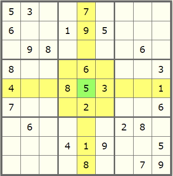
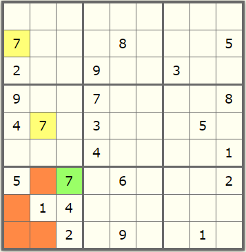
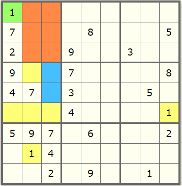
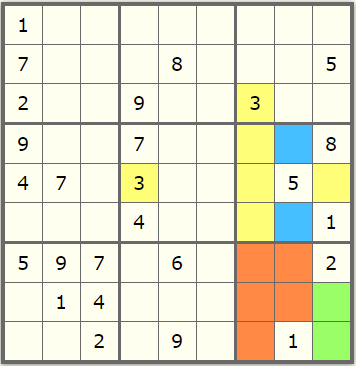
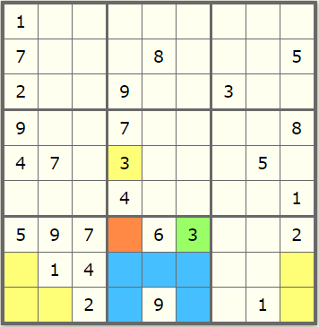
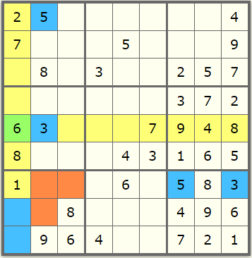

# **Explanation of Sudoku solver**

## ***General information***

The solution presented in the script 'code_solve_sudoku.py' is based on four different types of movements or steps, namely

1. Basic completion (row-wise, column-wise and subbox)
2. First level of influence from neighbor subboxes
3. Second and third level of influence from neighbor subboxes
4. General completion

Movements are repeated in the order previously described, until the Sudoku's board is completely solved. An entire cycle of movements is called an *iteration*. 

## ***Inputs and outputs***

The script 'code_solve_sudoku.py' receives as input a Sudoku's board recreated as a list of lists. Of course, it should represent a 9x9 block. Characters allowed in the input are "1", "2", "3", "4", "5", "6", "7", "8", "9", and "." for representing an empty cell. 

As output the script gives a dictionary with the following pieces of information:
- original_board: input resembling the original Sudoku's board
- valid_input: boolean variable that states if the input is valid or not
- solved: boolean variable that indicates if the Sudoku's board was solved
- solution: Sudoku's board completed
- solution_history: dictionary having the entire history of the solution, step by step
- number_iterations: number of iterations needed to find the solution 

## ***Description of movements or steps***

### 1. Basic completion

It takes into account occupied numbers in the corresponding row, column and subbox of each cell. If only one number is left, such number is assigned to the cell.

  

### 2. First level of influence from neighbor subboxes

Consider the presence of a value in the neighbor subboxes (yellow cells), in order to disable cells within the subbox under consideration (red cells). If one single cell remains available in the subbox, the value is assigned to it (green cell).

  

### 3. Second and third level of influence from neighbor subboxes

Cells can also be disabled even if the value does not appear explicitly in the neighbor subboxes. In the image below, the presence of number 1 (filled yellow cells) blocked some cells in the left-middle subbox (empty yellow cells), leaving only two available positions for number 1 in that subbox (blue cells). Any of these two options disable the entire right column of the left-top subbox (red cells). Taking into account that the central column is also disabled (red cells) in such subbox, there is only one position left for number 1 (green cell). This interaction is called as the second level of influence from neighbor subboxes.

  

There is a more complex level of influence, denoted here as the third level. It appears as a combination of multiple interactions between subboxes. For instance, the image below shows the influence of numbers 3 (filled yellow cells) on the right-middle subbox, disabling some positions (empty yellow cells) and allowing only two possible spots for the number 3 in the subbox (blue cells). As in the previous case, these two options disable the central column of the right-bottom subbox (red cells). Therefore, there are only two available spots for the number 3 in the right-bottom subbox (green cells).

  

Let us continue our example using the image below. The available positions for the number 3 in the left-bottom and right-bottom subboxes are constrained to the bottom and middle rows (empty yellow cells). Therefore, these rows are disabled for the central-bottom subbox (blue cells). Additionally, the number 3 of the central-middle subbox (filled yellow cell) blocks one spot in the central-bottom subbox (red cell). Thus, there is only reamining position for the number 3 in the central-bottom subbox (green cell).

  

### 4. General completion

The general way of completion is based on discarding values from each empty position in the board. Suppose a situation like the one showed in the image below. In the left-bottom subbox some positions are disabled for numbers 3 and 5 (red cells), due the influence of these values in other subboxes (filled blue cells). Therefore, there are only two available spots for these numbers in the left-bottom subbox (empty blue cells). Now, consider the cell highlighted in green. Checking its row-wise and column-wise neighbor cells (yellow cells), it is evidenced that all numbers are present, except for numbers 5 and 6. However, giving a second sight it can be noticed that number 5 is indeed present, as it has only two possible locations in the left-bottom subbox (empty blue cells). In this way, the only remaining possibility is number 6 (green cell).

  