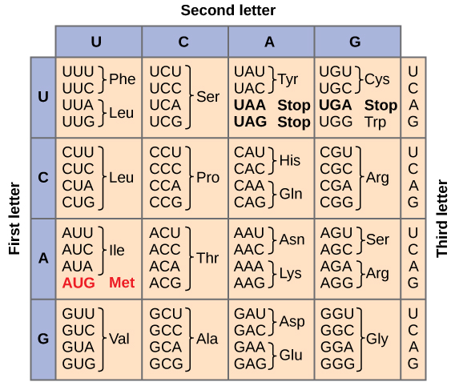

# **Explanation DNA to protein translation**

## ***Introduction to the translation theory: DNA ⇒ RNA ⇒ Protein***

Life depends on the ability of cells to store, retrieve, and translate genetic instructions. These instructions are needed to make and maintain living organisms. For a long time, it was not clear what molecules were able to copy and transmit genetic information. We now know that this information is carried by the deoxyribonucleic acid or DNA in all living things. 

DNA is a discrete code physically present in almost every cell of an organism. We can think of DNA as a one dimensional string of characters with four characters to choose from. These characters are A, C, G, and T. They stand for the first letters with the four nucleotides used to construct DNA. The full names of these nucleotides are Adenine, Cytosine, Guanine, and Thymine. Each unique three character sequence of nucleotides, sometimes called a nucleotide triplet, corresponds to one amino acid. The sequence of amino acids is unique for each type of protein and all proteins are built from the same set of just 20 amino acids for all living things. 

Instructions in the DNA are first transcribed into RNA and the RNA is then translated into proteins. We can think of DNA, when read as sequences of three letters, as a dictionary of life. 

## ***Objective of the challenge***

Aim: Convert a given sequence of DNA into its Protein equivalent. 

Source: Download a DNA strand as a text file from a public web-based repository of DNA sequences from NCBI. The Nucleotide sample is ( NM_207618.2 ), which can be found here (https://www.ncbi.nlm.nih.gov/nuccore/NM_207618.2).

## ***Translation steps***

The transciption is a two step process. Initially, DNA is converted to RNA. Then, triplets of RNA or codons are translated into amino acids. The first step is straightforward. In the DNA chain the nucleotid Thymine (T) is replaced by nucleotide Uracil (U). The second step requires a dictionary of equivalences between codons and aminoacids. Such dictionary is shown in the image below.

The 3-characters abbreviation represents an amino acid. The list of the 20 fundamental aminocids is the following:

| Amino acid | 3-char Abbrev | 1-char Abbrev |
| :----: | :----: | :----: |
| Alanine | Ala | A
| Arginine | Arg | R
| Asparagine | Asn | N
| Aspartic acid | Asp | D
| Cysteine | Cys | C
| Glutamine | Gln | Q
| Glutamic acid | Glu | E
| Glycine | Gly | G
| Histidine | His | H
| Isoleucine | Ile | I
| Leucine | Leu | L
| Lysine | Lys | K
| Methionine | Met | M
| Phenylalanine | Phe | F
| Proline | Pro | P
| Serine | Ser | S
| Threonine | Thr | T
| Tryptophan | Trp | W
| Tyrosine | Tyr | Y
| Valine | Val | V

The codon that marks the beginning of the sequence for any protein is 'AUG', corresponding to the amino acid Methionine (Met/M). On the other hand, there are three codons that indicate the stop of the sequence. These are 'UAA', 'UAG', and 'UGA'. 

## ***Inputs and outputs***

In total, the script 'code_dna_to_protein_translation.py' receives four inputs. These are: 

- List of aminoacids (plain text file)
- Dictionary of codons and amino acids (JSON file)
- Input DNA sequence (plain text file)
- Output expected protein sequence (plain text file)

As output, the script gives the entire amino acids sequence for the first protein found in the DNA sequence.

## ***Description of the script***

First utilities that allow the transcription are loaded. This includes the list of amino acids ('input_aminoacids.dat') and the dictionary of codons and amino acids ('input_codon_to_aminoacids.json'). Then, both sources are combined to generate a dictionary where codons are keys and 1-character abbreviation of amino acids are values.

Then, the DNA sequence input ('input_dna_sequence.dat') is loaded and translated into RNA. Afterwards the resulting RNA sequence is cropped since the first 'AUG' codon found until the first stop codon found, i.e. any among 'UAA', 'UAG' and 'UGA'. This crop procedure ensure we are dealing with the first entire protein described by the orginal DNA sequence.

Afterwards, the codons of the cropped RNA are transcripted using the modified dictionaty of codons and amino acids. Finally, the result achieved is compared to the output expected ('output_protein_expected.dat'). As final result, the script gives the original DNA sequence, the amino acid sequence of the first protein found, and a boolean value indicating if the output is the same as the expected one.

